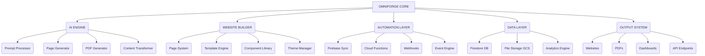

# OMNIFORGEAI- 🚀

OmniForge is an AI-powered, modular, empire-grade website builder and automation engine. It is designed to generate full-stack websites, PDFs, pages, dashboards, and engagement systems from a single command. Built for scalable SaaS applications, automation workflows, and digital product empires.

## 🌟 Description

OmniForge aims to revolutionize website creation and management by leveraging AI. It offers a comprehensive solution for building complex web applications, generating dynamic reports, and automating various business processes. The system supports multi-page architectures, PDF generation, content automation, AI agents, and seamless cloud synchronization with Firebase and Node.js/Python backends.

## 📝 Table of Contents

- [Project Title & Badges](#project-title--badges)
- [Description](#description)
- [Table of Contents](#table-of-contents)
- [Features](#features)
- [Tech Stack](#tech-stack)
- [System Architecture](#system-architecture)
- [Installation](#installation)
- [Usage](#usage)
- [Project Structure](#project-structure)
- [Contributing](#contributing)
- [License](#license)
- [Important Links](#important-links)
- [Footer](#footer)

## ✨ Features

*   **AI Website Generator:** Automatically generates multi-page websites with dynamic routing.
*   **PDF Builder & Auto Writer:** Creates structured PDFs from various inputs, serving as reports, invoices, or ebooks.
*   **Content Transformer:** Converts text, messages, or files into interactive User Interfaces (UI).
*   **Automation Pipelines:** Manages event-driven workflows, including email, analytics, and CRM integrations.
*   **Firebase & Cloud Function Integration:** Seamlessly integrates with Firebase for authentication, database, and cloud functions.
*   **Plugin-based Page System:** Supports a drag-and-drop architecture for flexible page building.
*   **AI Content Engine:** Transforms prompts and text into UI layouts and dashboard elements.
*   **Cloud Integration:** Supports Firebase (Auth, DB, Storage) and Node.js/Python backend functions.

## 🛠️ Tech Stack

*   **Languages:** TypeScript, Python, JavaScript
*   **Frameworks/Libraries:** React, Next.js
*   **Cloud Services:** Firebase (Firestore, Cloud Functions, Storage), Google Cloud Storage (GCS)
*   **AI:** LLM Router, AI Agents

## 🏗️ System Architecture (Empire-Level)



## 📥 Installation

As the project is currently described as an idea and blueprint, explicit installation instructions and dependencies are not yet defined in the analyzed code. Future development will likely involve setting up a Node.js environment and integrating with Firebase. 

**Potential Steps (Based on Description):**

1.  **Clone the repository:**
    ```bash
    git clone https://github.com/rananisarsb51214-web/OMNIFORGEAI-
    cd OMNIFORGEAI-
    ```
2.  **Set up Firebase Project:**
    *   Create a Firebase project at [https://console.firebase.google.com/](https://console.firebase.google.com/).
    *   Configure Firebase services (Authentication, Firestore, Cloud Functions).
    *   Download your `serviceAccountKey.json` and place it in the appropriate directory (e.g., `.firebase/`).
3.  **Install Node.js dependencies (if applicable):**
    ```bash
    npm install
    # or
    yarn install
    ```
4.  **Configure Environment Variables:**
    *   Set up necessary environment variables for Firebase and other services.

## ▶️ Usage

OmniForge is designed to be operated primarily through a CLI tool. The following are example commands demonstrating its capabilities:

*   **Create a new website project:**
    ```bash
    npx omniforge create website "AI SaaS landing page with blog + pricing + dashboard"
    ```
*   **Generate a PDF report:**
    ```bash
    npx omniforge generate pdf "Business report Q2 analytics"
    ```
*   **Deploy the project to Firebase:**
    ```bash
    npx omniforge deploy --firebase
    ```

## 📂 Project Structure

The repository primarily contains documentation. A typical structure for a project like this, based on the architecture described, might include:

```
/
├── public/
├── src/
│   ├── components/
│   ├── pages/
│   ├── utils/
│   ├── services/
│   └── types/
├── functions/      # Firebase Cloud Functions
├── scripts/        # CLI scripts
├── .env            # Environment variables
├── firebase.json   # Firebase configuration
├── next.config.js  # Next.js configuration
├── package.json    # Node.js dependencies
└── README.md       # Project documentation
```

*Note: This structure is a projection based on the described architecture and common Next.js/Firebase project setups.* 

## 🤝 Contributing

Contributions are welcome! Please follow these guidelines:

1.  **Fork the repository:** Create your own fork of the project.
2.  **Create a new branch:** `git checkout -b feature/your-feature-name`
3.  **Make your changes:** Implement your feature or fix.
4.  **Commit your changes:** `git commit -m 'Add some feature'`
5.  **Push to the branch:** `git push origin feature/your-feature-name`
6.  **Open a Pull Request:** Submit a PR to the `main` branch of the original repository.

Please ensure your code follows the project's coding standards and includes relevant tests if applicable.

## 📜 License

This project is licensed under the **Apache License 2.0**. See the `LICENSE` file for more details.

## 🔗 Important Links

*   **Repository:** [https://github.com/rananisarsb51214-web/OMNIFORGEAI-](https://github.com/rananisarsb51214-web/OMNIFORGEAI-)
*   **Author Profile:** [rananisarsb51214-web](https://github.com/rananisarsb51214-web)

## 📄 Footer

© 2023 OmniForgeAI-

[OMNIFORGEAI-](https://github.com/rananisarsb51214-web/OMNIFORGEAI-) | Built with ❤️ by [rananisarsb51214-web](https://github.com/rananisarsb51214-web)

--- 

**Show your support:**

[](https://github.com/rananisarsb51214-web/OMNIFORGEAI-/stargazers)
[](https://github.com/rananisarsb51214-web/OMNIFORGEAI-/forks)
[](https://github.com/rananisarsb51214-web/OMNIFORGEAI-/issues)


---
**<p align="center">Generated by [ReadmeCodeGen](https://www.readmecodegen.com/)</p>**