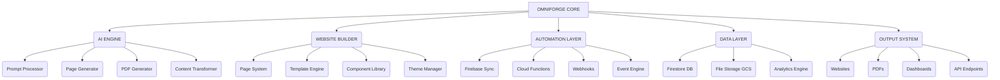

# OMNIFORGEAI- 🚀

[](https://opensource.org/licenses/Apache-2.0)
[](https://github.com/rananisarsb51214-web/OMNIFORGEAI-/stargazers)
[](https://github.com/rananisarsb51214-web/OMNIFORGEAI-/forks)
[](https://github.com/rananisarsb51214-web/OMNIFORGEAI-/issues)

OmniForge is an AI-powered, modular, empire-grade website builder and automation engine that generates full-stack websites, PDFs, pages, dashboards, and engagement systems from a single command. It's built for scalable SaaS applications, robust automation workflows, and creating expansive digital product empires.

## 🌟 Overview

OmniForge aims to revolutionize website creation and management by leveraging advanced AI capabilities. This comprehensive solution enables the construction of complex web applications, dynamic report generation, and the automation of various business processes with unprecedented efficiency. The system inherently supports multi-page architectures, sophisticated PDF generation, intelligent content automation, autonomous AI agents, and seamless cloud synchronization, integrating flawlessly with Firebase and powerful Node.js/Python backends.

## 📝 Table of Contents

- [🌟 Overview](#-overview)
- [✨ Features](#-features)
- [🛠️ Tech Stack](#%F0%9F%9B%A0%EF%B8%8F-tech-stack)
- [🏗️ System Architecture (Empire-Level)](#%F0%9F%8F%97%EF%B8%8F-system-architecture-empire-level)
- [📥 Installation](#%F0%9F%93%A5-installation)
- [▶️ Usage](#%E2%96%B6%EF%B8%8F-usage)
- [📂 Project Structure](#%F0%9F%93%81-project-structure)
- [🤝 Contributing](#%F0%9F%A4%9D-contributing)
- [📜 License](#%F0%9F%93%99-license)
- [🔗 Important Links](#%F0%9F%94%97-important-links)
- [📄 Footer](#%F0%9F%93%84-footer)

## ✨ Features

OmniForge is packed with powerful features designed to streamline and automate your digital presence:

*   **AI Website Generator:** Automatically crafts multi-page websites complete with dynamic routing, saving significant development time.
*   **PDF Builder & Auto Writer:** Generates structured PDFs from diverse inputs, perfect for reports, invoices, eBooks, and more.
*   **Content Transformer:** Converts raw text, messages, or files into rich, interactive User Interfaces (UI) and engaging content.
*   **Automation Pipelines:** Manages sophisticated, event-driven workflows, facilitating seamless integrations with email services, analytics platforms, and CRM systems.
*   **Firebase & Cloud Function Integration:** Offers robust and seamless integration with Firebase for authentication, real-time database capabilities, and scalable serverless cloud functions.
*   **Plugin-based Page System:** Features a flexible drag-and-drop architecture, enabling intuitive and customizable page building experiences.
*   **AI Content Engine:** Transforms simple prompts and textual inputs into complex UI layouts and dynamic dashboard elements, leveraging advanced AI.
*   **Cloud Integration:** Provides comprehensive support for Firebase (Authentication, Firestore Database, Cloud Storage) and flexible Node.js/Python backend functions for ultimate scalability.

## 🛠️ Tech Stack

This project leverages a cutting-edge technology stack to deliver its powerful capabilities:

| Category          | Technologies                                     |
| :---------------- | :----------------------------------------------- |
| **Languages**     | TypeScript, Python, JavaScript                   |
| **Frameworks/Libs** | React, Next.js                                   |
| **Cloud Services** | Firebase (Firestore, Cloud Functions, Storage), Google Cloud Storage (GCS) |
| **AI**            | LLM Router, AI Agents                            |

## 🏗️ System Architecture (Empire-Level)

The OmniForge system is designed with a modular, scalable architecture, depicted below:



## 📥 Installation

As of the current analysis, OmniForge is conceptualized as an idea and blueprint. The following installation steps are based on the project's described architecture and assumed technologies, rather than explicit instructions found in executable code.

**Potential Steps (Based on Description):**

1.  **Clone the repository:** 📂
    ```bash
    git clone https://github.com/rananisarsb51214-web/OMNIFORGEAI-
    cd OMNIFORGEAI-
    ```
2.  **Set up Firebase Project:** 🔥
    *   Create a new Firebase project via the [Firebase Console](https://console.firebase.google.com/).
    *   Enable and configure essential Firebase services such as Authentication, Firestore Database, and Cloud Functions.
    *   Download your `serviceAccountKey.json` and strategically place it within your project directory (e.g., in a `.firebase/` folder).
3.  **Install Node.js dependencies (if applicable):** 📦
    ```bash
    npm install
    # or
    yarn install
    ```
4.  **Configure Environment Variables:** ⚙️
    *   Establish and set up all necessary environment variables required for Firebase and any other integrated services to function correctly.

## ▶️ Usage

OmniForge is designed for efficiency, primarily operated through a powerful Command Line Interface (CLI) tool. Below are examples showcasing its capabilities:

*   **Create a new website project:** 🌐
    ```bash
    npx omniforge create website "AI SaaS landing page with blog + pricing + dashboard"
    ```
    This command initiates the generation of a multi-page website based on a detailed prompt.

*   **Generate a PDF report:** 📄
    ```bash
    npx omniforge generate pdf "Business report Q2 analytics"
    ```
    Utilize this to automatically create structured PDF documents from specified data or content.

*   **Deploy the project to Firebase:** 🚀
    ```bash
    npx omniforge deploy --firebase
    ```
    This command facilitates the deployment of your OmniForge project and its associated Firebase resources.

## 📂 Project Structure

While the repository currently features primarily documentation, a typical project structure for an AI-powered, full-stack application built with Next.js and Firebase, as described, would likely include:

```
/
├── public/           # Static assets (images, fonts)
├── src/              # Source code for Next.js application
│   ├── components/   # Reusable UI components
│   ├── pages/        # Next.js pages (routes)
│   ├── utils/        # Utility functions and helpers
│   ├── services/     # API clients, Firebase services
│   └── types/        # TypeScript type definitions
├── functions/        # Firebase Cloud Functions (backend logic)
├── scripts/          # CLI scripts and automation tools
├── .env              # Environment variables configuration
├── firebase.json     # Firebase project configuration
├── next.config.js    # Next.js framework configuration
├── package.json      # Node.js project dependencies and scripts
└── README.md         # Project documentation (this file)
```

*Note: This structure is a projection based on the described architecture and common Next.js/Firebase project setups, as actual code files detailing this structure were not present in the analyzed repository.*

## 🤝 Contributing

We welcome contributions to OmniForge! To contribute, please follow these guidelines:

1.  **Fork the repository:** Start by creating your own fork of the project to work on.
2.  **Create a new branch:** Use a descriptive name for your branch: `git checkout -b feature/your-feature-name` or `fix/your-bug-fix`.
3.  **Make your changes:** Implement your feature, fix a bug, or improve documentation.
4.  **Commit your changes:** Write a clear, concise commit message: `git commit -m 'Add new feature X'`
5.  **Push to the branch:** Upload your changes to your forked repository: `git push origin feature/your-feature-name`
6.  **Open a Pull Request:** Submit a Pull Request to the `main` branch of the original OmniForge repository.

Please ensure your code adheres to any existing coding standards and includes relevant tests where applicable.

## 📜 License

This project is open-sourced under the **Apache License 2.0**. For more detailed information, please refer to the [LICENSE](LICENSE) file included in this repository.

## 🔗 Important Links

*   **Repository:** [https://github.com/rananisarsb51214-web/OMNIFORGEAI-](https://github.com/rananisarsb51214-web/OMNIFORGEAI-)
*   **Author Profile:** [rananisarsb51214-web](https://github.com/rananisarsb51214-web)

## 📄 Footer

© 2023 OmniForgeAI-

[OMNIFORGEAI-](https://github.com/rananisarsb51214-web/OMNIFORGEAI-) | Built with ❤️ by [rananisarsb51214-web](https://github.com/rananisarsb51214-web)

---

**Show your support:**

[](https://github.com/rananisarsb51214-web/OMNIFORGEAI-/stargazers)
[](https://github.com/rananisarsb51214-web/OMNIFORGEAI-/forks)
[](https://github.com/rananisarsb51214-web/OMNIFORGEAI-/issues)

---
**<p align="center">Generated by [ReadmeCodeGen](https://www.readmecodegen.com/)</p>**

---
**<p align="center">Generated by [ReadmeCodeGen](https://www.readmecodegen.com/)</p>**


---
**<p align="center">Generated by [ReadmeCodeGen](https://www.readmecodegen.com/)</p>**